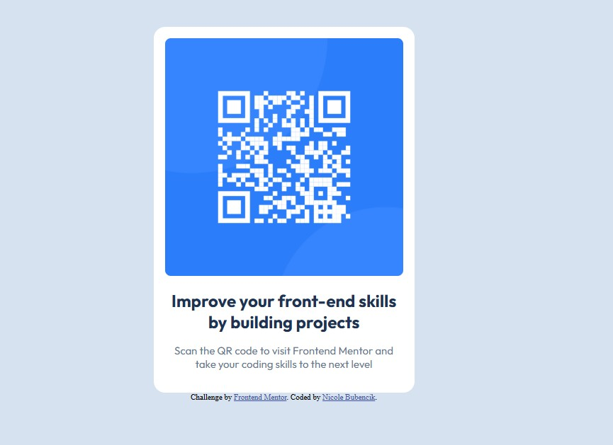

# QR code component solution

This is a solution to the [QR code component challenge on Frontend Mentor](https://www.frontendmentor.io/challenges/qr-code-component-iux_sIO_H). Frontend Mentor challenges help you improve your coding skills by building realistic projects.

## Table of contents

- [Overview](#overview)
  - [Screenshot](#screenshot)
  - [Links](#links)
- [My process](#my-process)
  - [Built with](#built-with)
  - [What I learned](#what-i-learned)

## Overview

### Screenshot

### Links

- [Solution URL](https://github.com/nikkiBubencik/QR_code_component)
- [Live Site URL](https://nikkibubencik.github.io/QR_code_component/)

## My process

### Built with

- Semantic HTML5 markup
- CSS custom properties
- CSS Variables
- Flexbox

### What I learned

Through this challenge, I strengthened my core understanding of HTML and CSS, particularly in creating responsive and semantically structured layouts. I also focused on writing maintainable styles by implementing CSS variables for the first time, which significantly improved consistency and simplified future adjustments."
